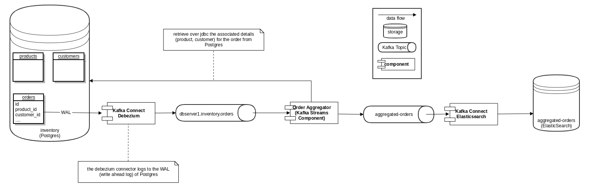

# Sink information from Postgres towards ElasticSearch via Debezium

## Introduction

This is a proof of concept project used for showcasing how to eventually sync data from Postgres database towards ElasticSearch via [Debezium](https://debezium.io/).

The main idea is to try to sync not only one database entity, but an aggregation of multiple entities towards
a downstream service/database.

The [Debezium](https://debezium.io/) Kafka connector can read from the transaction log of the database and provide
for each entity a corresponding topic where the state of the
entity before and after the transaction is being logged.
Nevertheless, within downstream services (e.g. : a search index) there is often
needed an aggregation of multiple related database entities.

This project acts as a proof of concept for such an aggregation by synchronizing the orders performed in an _inventory_ database into an [Elasticsearch](https://www.elastic.co/) search index.

When performing CRUD operations on the orders table from the Postgres database, the changed orders (along with their related entities) will be eventually synchronized (in near-real-time) towards the search index.


The database is comprised of the following tables:

- orders
- customers
- products

where each order has  a  foreign key towards a customer and to a product.


 

The topic previously mentioned has been already researched at Debezium:

[Domain Data Driven aggregates with Debezium](https://debezium.io/blog/2018/03/08/creating-ddd-aggregates-with-debezium-and-kafka-streams/)

>There are use cases however, where things are a bit more tricky. It is sometimes useful to share information across services and data stores by means of so-called aggregates, which are a concept/pattern defined by domain-driven design (DDD). In general, a DDD aggregate is used to transfer state which can be comprised of multiple different domain objects that are together treated as a single unit of information.
>
>Concrete examples are:
>- customers and their addresses which are represented as a customer record aggregate storing a customer and a list of addresses
>- orders and corresponding line items which are represented as an order record aggregate storing an order and all its line items

https://github.com/debezium/debezium-examples/tree/master/kstreams


This project follows a rather different approach, by retrieving the entities related to the orders via *JDBC* select statements.
At the cost of reading explicitly (in the aggregation Kafka Stream application) the associated entities via JDBC, there can be achieved the need of having (eventually) up-to-date aggregated order entries in the search index.
 


[Avro](https://avro.apache.org/) is being used for data serialization over Apache Kafka.

## Overview




## Installation


### Create own version of debezium/connect-jdbc-es in order to have the elasticsearch configuration for kafka-connect

```
export DEBEZIUM_VERSION=0.9
cd connect-jdbc-es
docker build -t debezium/connect-jdbc-es:0.9 .
```

This image is then referenced in the docker-compose-postgres.yaml file.


### Start the cluster as defined in http://debezium.io/docs/tutorial/
```
export DEBEZIUM_VERSION=0.9
docker-compose -f docker-compose-postgres.yaml up
```


### Start Postgres connector
```
curl -i -X POST -H "Accept:application/json" -H  "Content-Type:application/json" http://localhost:8083/connectors/ -d @register-postgres-smt.json
```


### Start Elasticsearch connector

```
curl -i -X POST -H "Accept:application/json" -H  "Content-Type:application/json" http://localhost:8083/connectors/ -d @es-sink-aggregated-orders.json
```


### Build the aggregation kafka streaming application

```
cd aggregation
mvn clean install
```

### Register the aggregated order subject in the schema registry

```
cd aggregation 
mvn schema-registry:register
```

### Run the kafka stream application

```command line parameters
dbserver1.inventory.orders aggregated-orders localhost:9092
```


### Verify that the data has been synced to ElasticSearch

```
curl http://localhost:9200/aggregated-orders/_search | jq
```


### Shut down the cluster
```
docker-compose -f docker-compose-postgres.yaml down
```


## Useful commands

Consume messages from a Debezium topic
```
docker-compose -f docker-compose-postgres.yaml exec kafka /kafka/bin/kafka-console-consumer.sh \
    --bootstrap-server kafka:9092 \
    --from-beginning \
    --property print.key=true \
    --topic dbserver1.inventory.customers
```


Consume messages from a Debezium topic with Avro

```
docker-compose -f docker-compose-postgres.yaml exec schema-registry /usr/bin/kafka-avro-console-consumer \
    --bootstrap-server kafka:9092 \
    --from-beginning \
    --property print.key=true \
    --property schema.registry.url=http://schema-registry:8081 \
    --topic dbserver1.inventory.orders
```


Modify records in the database via Postgres client

```
docker-compose -f docker-compose-postgres.yaml exec postgres env PGOPTIONS="--search_path=inventory" bash -c 'psql -U $POSTGRES_USER postgres'
```


See the kafka connect connectors configuration

```
curl -H "Accept:application/json" localhost:8083/connectors/ | jq
```

See the elasticsearch kafka-connect connector configuration

```
curl -H "Accept:application/json" localhost:8083/connectors/elastic-sink | jq
```

See the logs of the kafka-connect container

```
docker-compose -f docker-compose-postgres.yaml logs connect
```

See the contents of the `dbserver1.inventory.customers` elasticsearch index

```
curl http://localhost:9200/dbserver1.inventory.customers/_search | jq
```


See the aggregated orders where `Sally` terms comes along

```
curl http://localhost:9200/aggregated-orders/_search\?q\=Sally | jq
```


```
curl http://localhost:9200/aggregated-orders/_search\?q\=customer.first_name:Sally | jq

```

Reset offsets of the kafka stream application

More details here: https://www.confluent.io/blog/data-reprocessing-with-kafka-streams-resetting-a-streams-application/

```
./kafka-streams-application-reset --application-id streaming-db-aggregator \
                                  --input-topics dbserver1.inventory.orders \
                                  --intermediate-topics streaming-db-aggregator-dbserver1.inventory.ordersSTATE-STORE-0000000000-changelog \
                                  --bootstrap-servers localhost:9092
```

Show topics

```
./kafka-topics --list --zookeeper localhost:2181
```


See the subjects in the schema registry


```
curl -X GET http://localhost:8081/subjects/
```


See a subject detail in the schema registry

```
curl -X GET http://localhost:8081/subjects/order/versions/1 | jq '.schema | fromjson'
```


Running the aggregation stream

```command line parameters
dbserver1.inventory.orders aggregated-orders localhost:9092
```


## Tutorials

Schema Registry tutorial
https://docs.confluent.io/current/schema-registry/schema_registry_tutorial.html


Debezium Tutorial

https://github.com/debezium/debezium-examples/blob/master/tutorial/README.md


Streaming from Debezium to ElasticSearch

https://debezium.io/blog/2018/01/17/streaming-to-elasticsearch/


## Further resources

https://debezium.io/blog/2019/02/19/reliable-microservices-data-exchange-with-the-outbox-pattern/


The Outbox Pattern
The idea of this approach is to have an "outbox" table in the service’s database. When receiving a request for placing a purchase order, not only an INSERT into the PurchaseOrder table is done, but, as part of the same transaction, also a record representing the event to be sent is inserted into that outbox table.

The record describes an event that happened in the service, for instance it could be a JSON structure representing the fact that a new purchase order has been placed, comprising data on the order itself, its order lines as well as contextual information such as a use case identifier. By explicitly emitting events via records in the outbox table, it can be ensured that events are structured in a way suitable for external consumers. This also helps to make sure that event consumers won’t break when for instance altering the internal domain model or the PurchaseOrder table.

https://github.com/debezium/debezium-examples/tree/master/outbox


https://dunningpostor.com/streaming-postgres-to-kafka-and-maintaining-consistency-and-transaction-isolation/

For instance, Debezium (and bottledwater) creates separate Kafka topics for each Postgres table. So when a transaction is committed that affects 5 tables, 5 different corresponding Kafka topics will each get at least 1 event appended to them (depending on how many records in that table were updated/inserted/removed).

Any stream processor consuming these Postgres-driven Kafka topics that wants to maintain the same data consistency and transaction isolation of the source database will need to be very careful not to produce data from only part of the original database transaction.


https://stackoverflow.com/questions/56250934/stream-join-example-with-apache-kafka

customer & answer join over KSQL